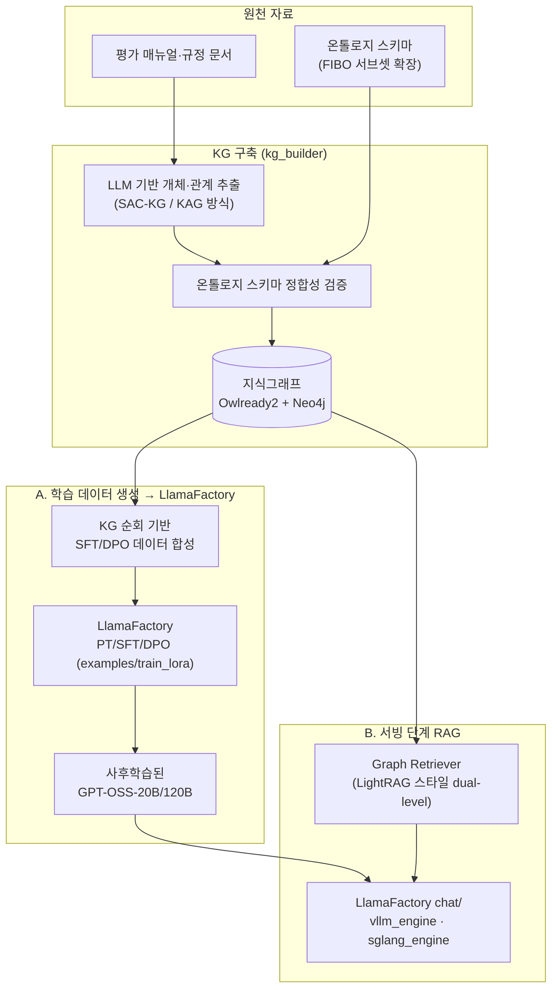

# 기업신용평가 특화모델: 사후학습 + 지식그래프·온톨로지 결합 통합 방안

LlamaFactory는 학습(PT/SFT/DPO/RM/PPO/KTO) 프레임워크이며, 지식그래프(KG)·온톨로지 결합은
그 범위 밖의 별도 계층이다. 이 문서는 GPT-OSS-20B/120B 사후학습(`examples/train_lora/gpt_oss_*`)에
KG·온톨로지를 결합하기 위해 검토한 오픈소스/방법론과, 이 저장소에 통합하는 방안을 정리한다.

## 1. 오픈소스·방법론 서베이

| 계층 | 후보 | 특징 | 이 프로젝트 적용 판단 |
|---|---|---|---|
| GraphRAG 엔진 | [Microsoft GraphRAG](https://github.com/microsoft/graphrag) | 계층적 커뮤니티 클러스터링, multi-hop 추론에 강하나 토큰 비용 높음 | 대규모 배치 인덱싱 단계 참고용 |
| | [LightRAG](https://github.com/HKUDS/LightRAG) | dual-level retrieval, 벤치마크상 GraphRAG 대비 토큰 비용 대폭 절감, CPU에서도 구동 | **1차 채택 후보** — 서빙 단계 경량 리트리버 |
| | [HippoRAG](https://github.com/OSU-NLP-Group/HippoRAG) | Personalized PageRank로 그래프 시드에서 다단 추론 전파 | multi-hop 질의(예: "이 기업과 계열관계인 기업의 최근 등급 변동은?") 필요시 검토 |
| | KAG (Ant Group) | 사람이 정의한 스키마(=온톨로지) 기반 구축으로 OpenIE 방식 대비 노이즈 감소 | **온톨로지 결합형 요구사항과 가장 부합** — 구축 방법론 참고 |
| 온톨로지 | [FIBO](https://github.com/edmcouncil/fibo) (EDM Council·OMG, OWL, W3C 표준) | 금융 계약·상품·리스크·기관 개념의 업계 표준 온톨로지, 오픈소스 | **채택** — 신용평가 온톨로지의 뼈대로 서브셋 확장 |
| | FRO (Financial Regulation Ontology, FIBO+LKIF 기반) | 규제·컴플라이언스 개념 포함 | 규제 준수 요건을 스키마에 반영할 때 참고 |
| 온톨로지 엔진(Python) | [Owlready2](https://owlready2.readthedocs.io/) | OWL 2 로드·추론(HermiT 내장), RDFLib 호환 SPARQL, 대규모 트리플 처리 검증됨 | **채택** — 경량, 순수 Python, 별도 JVM 불필요 |
| | RDFLib | RDF/SPARQL 처리 | Owlready2와 함께 보조적으로 사용 |
| 그래프 저장소 | Neo4j Community Edition | 프로덕션급 그래프 DB, GraphRAG 생태계와 연동 사례 많음 | 데이터 규모가 커지는 2단계 이후 채택 |
| | NetworkX | 인메모리 그래프, 설치 부담 없음 | PoC/소규모 단계 |
| KG 구축 방법론 | SAC-KG (Generator–Verifier–Pruner) | LLM 기반 KG 자동 구축, 3단계로 노이즈 억제 | 구축 파이프라인 설계에 참고 |
| | Ontology-grounded LLM 추출(스키마 정합성 검증형 접근) | 온톨로지 스키마로 추출 결과의 정합성을 검증 | KAG와 동일한 접근 — 검증 단계 설계에 참고 |
| 사후학습 | LlamaFactory (본 저장소) | GPT-OSS-20B/120B, Gemma-4-31B PT/SFT/DPO LoRA (`examples/train_lora/`) | 기 구축됨 |

## 2. 아키텍처 — 통합 지점은 두 곳

LlamaFactory 코드 자체는 수정하지 않는다. KG·온톨로지는 (A) 학습 데이터 생성 단계와
(B) 학습된 모델의 서빙 단계, 두 지점에서 애드온으로 연결한다.



- **(A) 데이터 생성 단계**: KG를 순회하며 "지표–판단기준–결론" 관계를 근거로 지시-응답/선호도 쌍을 합성한다.
  이전에 정리한 "문서 → SFT 데이터 합성" 파이프라인과 동일한 산출 형식(`data/dataset_info.json` 스키마)을
  그대로 따르므로, LlamaFactory 쪽 학습 설정(`examples/train_lora/gpt_oss_*_lora_sft.yaml` 등)은 변경이 필요 없다.
- **(B) 서빙 단계**: 학습이 끝난 모델을 `src/llamafactory/chat/`의 `vllm_engine`/`sglang_engine`으로 서빙할 때,
  질의를 그래프에서 먼저 조회해 근거 컨텍스트를 프롬프트에 주입하는 리트리버를 앞단에 붙인다. LlamaFactory는
  서빙/에이전트 오케스트레이션 프레임워크가 아니므로, 이 리트리버는 LlamaFactory 코드를 건드리지 않는
  독립 프로세스(사이드카)로 둔다.

## 3. 저장소 내 배치 계획 (제안)

KG·온톨로지 계층은 학습 코드와 결합도가 낮으므로, 신규 최상위 디렉토리로 분리해 배치하는 안을 제안한다
(`src/llamafactory/train/hyper_parallel/`, `src/llamafactory/train/mca/`가 기존 학습 스택과 분리된 애드온으로
배치된 것과 같은 방식):

```
integrations/
  credit_kg_ontology/
    README.md                  # 본 문서
    ontology/
      credit_evaluation.owl    # FIBO 서브셋을 확장한 신용평가 도메인 온톨로지
    kg_builder/                # 문서 → KG 추출·검증 파이프라인 (SAC-KG/KAG 방식)
    data_synthesis/            # KG 순회 → SFT/DPO 학습데이터 합성 (examples/ 스키마 그대로 출력)
    retrieval_plugin/          # 서빙 단계 Graph Retriever (LightRAG 스타일)
```

구현 코드는 이번 단계 범위(오픈소스 서베이·통합 방안)를 넘어서므로 포함하지 않았다. 각 하위 디렉토리는
실제 구현 착수 시점에 채운다.

## 4. 단계별 로드맵

| 단계 | 내용 | 산출물 |
|---|---|---|
| 1단계 | FIBO 서브셋 검토 → 신용평가 도메인 클래스/관계 확장(기업·재무지표·평가등급·규정) | `ontology/credit_evaluation.owl` 초안 |
| 2단계 | 보유 평가 매뉴얼·규정 문서를 온톨로지 스키마 기준으로 KG 추출 (KAG 방식: 스키마 우선 → LLM 추출 → 정합성 검증) | KG 인스턴스 (Owlready2/Neo4j) |
| 3단계 | KG 순회 기반 SFT/DPO 데이터 합성 → `examples/train_lora/gpt_oss_*` 파이프라인 투입 | LlamaFactory 학습 데이터셋 |
| 4단계 | 서빙 단계 Graph Retriever(LightRAG 스타일) PoC → 응답 근거 추적성 검증 | 리트리버 PoC + 평가 리포트 |

## 5. GPT-OSS-20B/120B 사후학습 규모 비교 (4× H200 기준)

| | GPT-OSS-20B | GPT-OSS-120B |
|---|---|---|
| 총 파라미터 / 활성 파라미터 | 20.9B / 3.6B (24 레이어, 32 experts top-4) | 117B / 5.1B (36 레이어, 128 experts top-4) |
| 학습 시 bf16 역양자화 기준 메모리 | 약 42GB | 약 234GB |
| LoRA (4×H200, ZeRO-3) | 매우 여유 (GPU당 약 10.5GB) | 여유 (GPU당 약 58.5GB) |
| 풀파인튜닝 (4×H200, ZeRO-3, 오프로드 없음) | **가능** (GPU당 약 84GB, 활동메모리 여유 충분) | 불가 (GPU당 약 468GB 필요) |

20B는 풀파인튜닝도 4×H200 예산 안에 들어오는 유일한 조합이다. `examples/train_lora/gpt_oss_20b_lora_*.yaml`을
120B와 동일한 PT→SFT→DPO 구조로 추가했으며(`examples/merge_lora/gpt_oss_20b_merge_*.yaml` 포함), 필요시 풀파인튜닝
설정도 추가로 준비할 수 있다.

## Sources

- [microsoft/graphrag](https://github.com/microsoft/graphrag)
- [HKUDS/LightRAG](https://github.com/HKUDS/LightRAG)
- [OSU-NLP-Group/HippoRAG](https://github.com/OSU-NLP-Group/HippoRAG)
- [edmcouncil/fibo](https://github.com/edmcouncil/fibo)
- [FIBO — EDM Council](https://edmcouncil.org/financial-industry-business-ontology/)
- [Financial Regulation Ontology](https://finregont.com/)
- [Owlready2 documentation](https://owlready2.readthedocs.io/en/latest/index.html)
- [gpt-oss-120b & gpt-oss-20b Model Card (OpenAI)](https://arxiv.org/pdf/2508.10925)
- [GPT-OSS-20B: A Comprehensive Deployment-Centric Analysis](https://arxiv.org/pdf/2508.16700)
