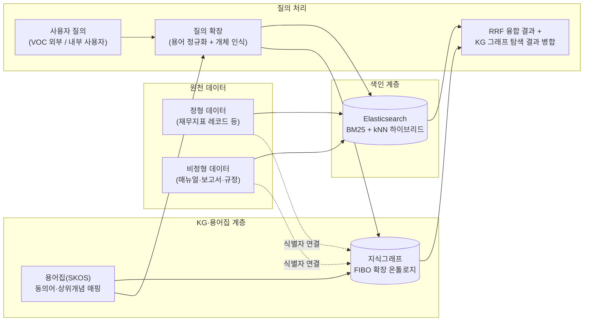
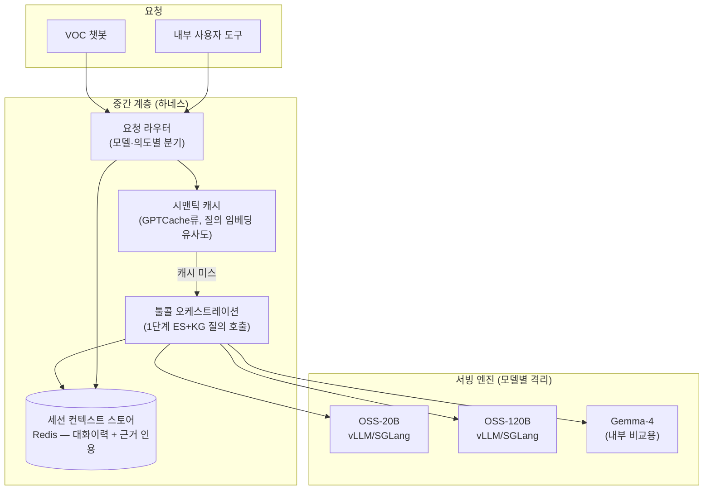

# 검색 품질 향상 + 멀티 LLM 서빙/캐싱 아키텍처 (Phase 1 → Phase 2)

`README.md`(KG·온톨로지 통합 방안)의 후속 문서. 1단계는 검색 품질 향상, 2단계는 멀티 LLM 서빙
구조에서의 컨텍스트 유지·캐싱을 다룬다. 두 단계 모두 아직 코드 스캐폴딩은 포함하지 않은
아키텍처 검토 단계다.

> **모델 표기 참고**: 아래에서 OSS-20B/120B와 함께 Gemma-4를 예시로 다룬다. 서비스④(코드 생성
> 에이전트)의 공식 채택 모델은 SSOT상 LUXIA GPT-OSS-120B로 확정되어 있으므로, 대외 산출물에는
> 이 표기를 유지하고 Gemma-4는 내부 비교·검증 용도로만 구분해 사용한다(이전 검토 내용과 동일).

## 1단계: 검색 품질 향상 (VOC + 내부 사용자 공통)

### 1-1. 검색 스택 — Elasticsearch 하이브리드 (별도 벡터DB 아님)

이 프로젝트의 표기 규칙상 검색엔진은 **Elasticsearch(kNN + BM25 하이브리드)**로 확정되어 있다.
Qdrant·Milvus 같은 전용 벡터DB를 별도로 두는 대신, Elasticsearch의 dense vector(kNN) 필드와
BM25 텍스트 필드를 하나의 인덱스에서 함께 사용해 "벡터DB + 하이브리드 검색"을 만족시킨다.

- **융합 방식**: RRF(Reciprocal Rank Fusion) — 점수 스케일이 다른 BM25/kNN을 정규화 없이
  순위 기반으로 안전하게 결합. Elasticsearch의 retriever API로 `standard`(BM25) + `knn`
  retriever를 정의하고 `rrf`로 감싸는 구성이 표준 패턴이다.
- **권장 설정 출발점**: `rank_window_size` 50~100에서 시작. 정확한 키워드 조회(회사명, 코드,
  법조문 번호 등)가 중요한 질의는 BM25 가중치를 높이고, 개념적 질의(예: "재무 안정성이 안
  좋은 이유는?")는 kNN 가중치를 높인다. 고재현율이 필요하면 ELSER(스파스 신경망 검색)를
  BM25+kNN에 3번째 retriever로 추가하는 구성도 검토 가능하다.
- **성능 참고치**: 하이브리드(RRF) 구성이 벡터 단독 대비 recall 개선폭이 크다는 벤치마크가
  다수 보고되어 있다 — 정확한 수치는 실제 데이터셋으로 재측정 필요.

### 1-2. 정형 + 비정형 데이터 연결 — KG/용어집이 맡는 역할

Elasticsearch는 "검색"을, KG·온톨로지·용어집은 "질의 이해와 데이터 간 연결"을 맡는다.

- **용어집(ECR 용어집 등)을 SKOS로 표현**: SKOS(W3C 표준, 시소러스·용어집에 특화된 경량
  온톨로지 언어)로 "부채비율 ≡ Debt Ratio ≡ 레버리지 비율" 같은 동의어·광의어 관계를 정의하면,
  질의 확장 단계에서 이 매핑을 그대로 활용할 수 있다. FIBO 자체가 세부 개념까지 규정하므로,
  용어집은 FIBO 개념에 대한 "라벨 사전" 역할로 얹는 것이 정합성 관리에 유리하다.
- **정형-비정형 교차 검색**: KG 노드가 Elasticsearch 문서 ID와 정형 레코드 키를 함께 들고
  있으면, 그래프를 1~2홉 탐색한 결과로 "이 지표를 설명하는 매뉴얼 문단"과 "이 지표의 실제 값"을
  동시에 가져올 수 있다.

### 1-3. 검색 품질 평가

- 오프라인 지표: nDCG@k, MRR — 사내 평가사가 만든 질의-정답 셋으로 정기 측정
- 온라인/생성 품질 지표: 이미 VOC 환각통제 요구사항에서 언급된 RAGAS 계열 임계치를 재사용

## 2단계: 멀티 LLM 서빙 구조 — 하네스, 컨텍스트 유지, 캐싱

1단계가 자리잡은 뒤, OSS-20B/120B(+비교용 Gemma-4) 등 여러 모델을 서빙하는 구조에 검색 계층을
공통으로 연결하고, 그 사이의 "중간 계층"이 컨텍스트 지속성과 캐싱을 담당하도록 한다.

### 2-1. 하네스(중간 계층)가 하는 일

- **요청 라우팅**: 지연시간이 중요한 VOC 질의는 OSS-20B로, 복잡한 다단계 추론이 필요한 내부
  평가 지원 질의는 OSS-120B로 분기하는 등 모델별 특성에 맞춘 라우팅 규칙을 둔다.
- **툴콜 오케스트레이션**: 1단계에서 만든 Elasticsearch+KG 하이브리드 검색을 "도구"로 노출해,
  모델이 필요할 때 호출하도록 조율한다.
- **세션 컨텍스트 스토어**: 멀티턴 대화에서 이전 턴에 사용한 근거(문서 인용, KG 개체)를
  Redis 등에 저장해 재사용 — 매 턴마다 검색을 처음부터 다시 하지 않도록 한다.

### 2-2. "지속적인" 검색·지식 유지를 위한 3단 캐싱

캐싱은 계층마다 성격이 달라 하나로 뭉뚱그리면 안 된다.

| 계층 | 무엇을 캐싱하나 | 도구 | 특성 |
|---|---|---|---|
| 검색결과 캐시 | Elasticsearch+KG 질의 결과(자주 조회되는 지표 설명, 서브그래프) | Redis, TTL 기반 | KG·문서 갱신 시 관련 키 무효화 필요 |
| 시맨틱 캐시 | 유사 질의에 대한 과거 응답/검색결과 | GPTCache(Milvus/Redis/Faiss 백엔드 지원) | 실측 히트율은 통상 20~45% 수준으로 기대치를 잡는 것이 현실적(벤더 자료의 90%대 수치는 과장된 경우가 많음) |
| 서빙 엔진 KV 캐시 | 모델이 실제로 계산한 어텐션 KV 값 | vLLM Automatic Prefix Caching(블록 해시 기반) 또는 SGLang RadixAttention(radix tree 기반, 멀티턴 대화처럼 흐름이 가변적일 때 유리) | **모델(엔진) 인스턴스별로 격리** — OSS-20B/120B/Gemma-4는 각각 별도 프로세스이므로 KV 캐시는 모델 간 공유되지 않는다 |

- KV 캐시 히트율을 높이려면 각 모델에 보내는 프롬프트의 **앞부분(시스템 프롬프트, 용어집
  요약, 자주 쓰는 지침)을 고정된 순서로 배치**해, 매 요청이 동일한 프리픽스로 시작하게 만드는
  것이 핵심이다. 뒷부분(사용자별 질의, 매번 달라지는 검색결과)은 그 뒤에 붙인다.
- vLLM 방식은 멀티-LoRA 서빙 시 LoRA ID를 캐시 키에 포함하는 방식도 지원하므로, LlamaFactory로
  학습한 LoRA 어댑터를 그대로 서빙에 올리는 구조와도 맞물린다.
- 멀티 모델 간 공유가 필요한 건 KV 캐시가 아니라 검색결과 캐시·시맨틱 캐시 쪽이다 — 이 두
  계층은 모델과 무관하게 애플리케이션(하네스) 레이어에 두면 된다.

## 참고 다음 단계

- 1단계(Elasticsearch 하이브리드 색인 + 용어집 SKOS화)부터 착수하는 것을 권장 — 2단계 하네스는
  1단계의 검색 API가 안정화된 뒤에 그 위에 얹는 것이 자연스럽다.
- 실제 구현은 이번 검토 범위를 넘어서므로 포함하지 않았다.

## Sources

- [Reciprocal rank fusion — Elasticsearch Reference](https://www.elastic.co/docs/reference/elasticsearch/rest-apis/reciprocal-rank-fusion)
- [Hybrid search in ES|QL: Multistage retrieval — Elasticsearch Labs](https://www.elastic.co/search-labs/blog/hybrid-search-multi-stage-retrieval-esql)
- [Automatic Prefix Caching — vLLM docs](https://docs.vllm.ai/en/v0.8.1/design/automatic_prefix_caching.html)
- [SGLang vs vLLM: Multi-Turn Chat and KV Cache Reuse](https://www.runpod.io/blog/sglang-vs-vllm-kv-cache)
- [Semantic Caching for LLM Inference: GPTCache, Redis Vector Cache, and Prompt Cache Setup (2026)](https://www.spheron.network/blog/semantic-cache-llm-inference-gpu-cloud/)
- [Top Semantic Caching Solutions for AI Apps in 2026](https://www.getmaxim.ai/articles/top-semantic-caching-solutions-for-ai-apps-in-2026/)
