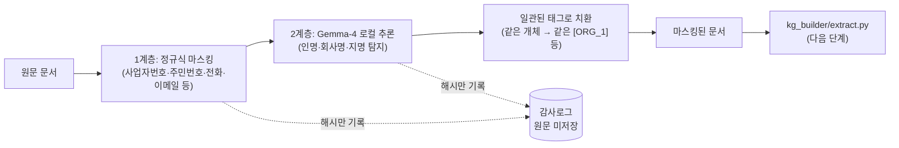

# 데이터 마스킹 모듈 — 폐쇄망 구현 가이드 (Gemma-4 기반)

원천 문서(교육자료·평가 사례 등)를 KG 구축(`integrations/credit_kg_ontology/kg_builder/`)이나
학습 데이터 합성에 넣기 전에, 식별정보(PII)를 제거하는 전처리 모듈이다. 인터넷 접속이 없는
내부 폐쇄망 환경에서 동작하는 것을 전제로 설계했다.

## 1. 왜 2계층인가

| 계층 | 대상 | 방식 | 파일 |
|---|---|---|---|
| 1계층 | 고정된 형태의 PII (사업자등록번호, 주민등록번호, 전화번호, 이메일, 카드번호, IP) | 정규식 — 결정론적, 모델 불필요 | `regex_masker.py` |
| 2계층 | 자유서술 개체 (사람 이름, 회사명, 지명·주소) | 로컬 서빙 Gemma-4에 NER 형태로 질의 | `llm_ner_masker.py` |

고정 패턴이 있는 정보를 굳이 LLM에 맡기면 느리고 비결정적이다. 반대로 회사명·인명은 패턴이
없어 정규식으로 못 잡으므로 LLM이 필요하다 — 이 프로젝트가 이미 후자를 위해 Gemma-4를
사후학습 대상으로 채택하고 있으므로(같은 모델을 마스킹에도 재사용), 별도 모델을 추가로
들여올 필요가 없다는 것이 이 설계의 핵심 이점이다.



## 2. 사용법

```bash
pip install -r integrations/data_masking/requirements.txt  # LLM 계층을 쓸 때만 필요

python3 - <<'PY'
import sys
sys.path.insert(0, "integrations/data_masking")
from pipeline import mask_document
from llm_ner_masker import GemmaLocalNER

# 1계층만 (모델 없이, 폐쇄망 반입 전 개발 단계에서도 바로 사용 가능)
result = mask_document(open("문서.txt").read())

# 1+2계층 (Gemma-4가 로컬에 반입된 이후)
ner = GemmaLocalNER(model_path="/opt/models/gemma-4-31b-it")  # 로컬 경로만 허용
result = mask_document(open("문서.txt").read(), detect_entities=ner.detect_entities)

print(result.masked_text)
for entry in result.audit_log:
    print(entry.category, entry.tag, entry.span_hash, entry.detector)
PY
```

`detect_entities=None`이면 1계층만 동작한다 — Gemma-4가 아직 폐쇄망에 반입되기 전 단계에서도
정규식 마스킹은 즉시 쓸 수 있다.

## 3. 폐쇄망 반입·배포 가이드

### 3-1. 인터넷이 되는 환경에서 사전 준비

폐쇄망 내부에서는 아무것도 다운로드할 수 없으므로, 아래를 **외부 환경에서 미리 받아** 승인된
매체(사내 반입 절차)로 옮긴다.

1. Gemma-4 체크포인트: `google/gemma-4-31B-it` (인스트럭션 튜닝판 — NER처럼 지시를 따르는
   작업에는 base가 아니라 이 체크포인트를 쓴다) 가중치 전체를 `huggingface-cli download`로
   로컬 디렉터리에 받는다.
2. Python 패키지: `requirements.txt`에 명시된 `transformers`, `torch` 및 그 하위 의존성을
   wheel(`.whl`)로 전부 받아둔다(`pip download -r requirements.txt -d wheels/`).
3. 두 산출물의 체크섬(sha256)을 기록해, 반입 후 무결성을 확인할 수 있게 한다.

### 3-2. 폐쇄망 내부 배포

1. 반입된 wheel을 사내 프라이빗 PyPI(또는 `pip install --no-index --find-links=wheels/`)로
   설치한다 — 어떤 설치 경로도 `pypi.org`를 참조해서는 안 된다.
2. 모델 디렉터리를 고정된 내부 경로(예: `/opt/models/gemma-4-31b-it`)에 배치한다.
3. `GemmaLocalNER(model_path=...)`에는 **이 로컬 경로만** 넘긴다. Hugging Face Hub id
   (`google/gemma-4-31B-it` 형태)를 넘기면 `llm_ner_masker.py`가 즉시 `ValueError`를
   발생시키도록 만들어 두었다 — 실수로 온라인 경로를 타는 것을 코드 레벨에서 막기 위함이다.

### 3-3. 런타임 무외부호출 강제 (2중 안전장치)

- `llm_ner_masker.py`는 import되는 순간 `HF_HUB_OFFLINE=1`, `TRANSFORMERS_OFFLINE=1`을
  설정한다. 이 두 값이 서 있으면 transformers는 어떤 상황에서도 허브에 접속을 시도하지 않는다.
- `AutoModelForCausalLM.from_pretrained(..., local_files_only=True)`로 한 번 더 강제한다.
- **다만 이 두 장치는 "이 프로세스가 실수로 호출하지 않게" 막는 것이지, 네트워크 자체를
  차단하는 것은 아니다.** 실제 폐쇄망 요건 충족은 인프라 레벨(방화벽·프록시 차단)에서
  별도로 보장해야 한다 — 이 모듈은 그 위에 얹는 애플리케이션 레벨 안전장치다.

### 3-4. 네트워크 격리 셀프체크

배포 후 아래 명령이 반드시 실패(타임아웃/연결거부)해야 정상이다.

```bash
curl -m 5 https://huggingface.co  # 반드시 실패해야 함
```

## 4. Gemma-4 상세 사용 가이드 (마스킹 전용)

| 항목 | 내용 |
|---|---|
| 체크포인트 | `google/gemma-4-31B-it` (dense 30.7B, "Thinking" 인스트럭션 튜닝판) |
| 템플릿 | `gemma4` (이 저장소의 `data/template.py`에 이미 등록된 것과 동일) |
| 정밀도 | bf16 권장 — 가중치만 약 61GB |
| GPU 요구사항 (추론 전용) | 학습이 아니므로 옵티마이저 상태가 없다. 단일 H200(141GB)이면 여유 있게 가능하고, 4bit 양자화(bnb-nf4)까지 적용하면 약 16GB로 줄어 중급 GPU 1장으로도 가능 |
| 배치/서빙 방식 | 소량·저빈도 호출(문서 단위 배치 처리)이면 `transformers` 직접 호출로 충분. 대량 문서를 상시 처리해야 하면 `src/llamafactory/chat/vllm_engine`으로 로컬 서빙하고 이 모듈을 그 API를 부르는 클라이언트로 바꾸는 편이 낫다 |
| 출력 형식 | JSON 배열 `[{"text": ..., "type": "PERSON|ORG|LOCATION"}]` — `NER_SYSTEM_PROMPT`로 강제, `parse_ner_response`가 코드펜스·잡담 섞인 응답도 관대하게 파싱 |

## 5. `kg_builder`와의 연결 지점

`integrations/credit_kg_ontology/kg_builder/extract.py`에 원문을 넣기 **전에** 이 모듈을
거치는 것을 권장한다. 실행 순서:

```
원문 문서 → data_masking/pipeline.py (마스킹) → kg_builder/extract.py (KG 추출)
```

마스킹된 문서 안의 회사명은 `[ORG_1]`처럼 태그로 바뀌므로, `kg_builder`의 `사례` 문서 형식
(`기업명: ...`)에도 실제 상호 대신 이 태그나 비식별 코드를 넣어 넘기면 된다 — 이전에
전달드린 데이터 준비 요청서의 "비식별 코드로 대체" 요건과 동일한 원칙이다.

## 6. 감사로그

`pipeline.py`의 `AuditEntry`는 마스킹된 원문을 저장하지 않고 `sha256` 해시(16자리로 절단)만
남긴다 — 감사 추적은 가능하되, 감사로그 자체가 새로운 PII 유출 경로가 되지 않도록 하기 위함이다
(ECR 프로젝트의 감사로그 원칙: AI기본법 §34 + 시행령 §26, 5년 보존과 동일한 사상).

## 7. 한계 및 사람 검토 원칙

- 정규식 계층은 결정론적이라 오탐이 거의 없지만, LLM NER 계층은 **인명·회사명을 놓치거나
  (재현율 문제) 엉뚱한 단어를 개체로 오인(정밀도 문제)할 수 있다.**
- 따라서 이 모듈은 사람 검토를 대체하지 않는다 — 마스킹 결과를 그대로 신뢰해 실제 고객
  데이터를 외부로 반출하는 근거로 삼지 말고, 최종 확인은 검토자가 수행해야 한다(HITL 원칙과
  동일한 이유).
- `tests/`의 유닛 테스트는 파이프라인 결합 로직(정규식+태그 일관성+감사로그)을 가짜 탐지기로
  검증한 것이며, 실제 Gemma-4의 탐지 정확도 자체를 보증하지 않는다 — 반입 후 실제 체크포인트로
  별도 정확도 평가를 수행할 것을 권장한다.
